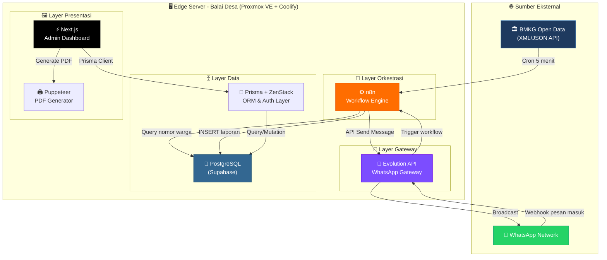
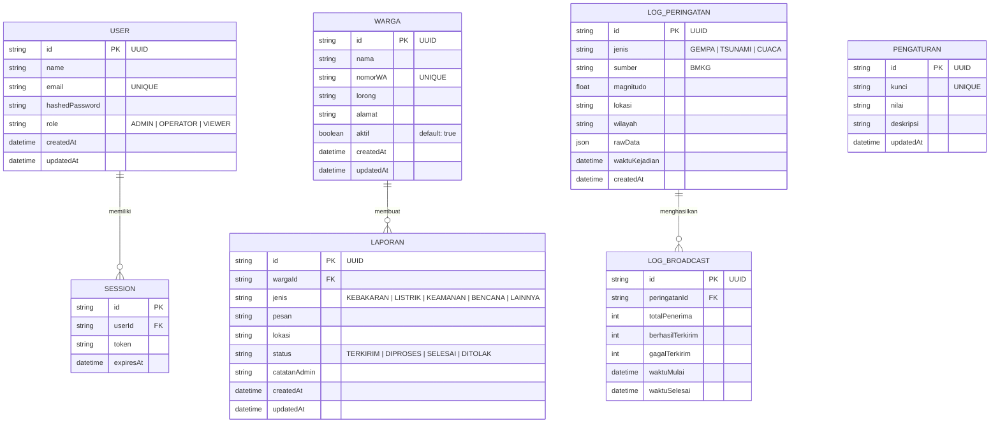
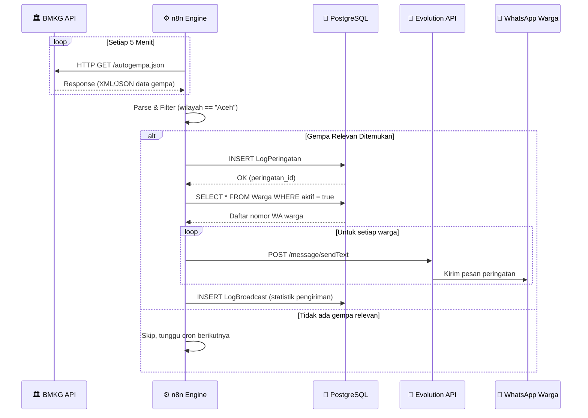
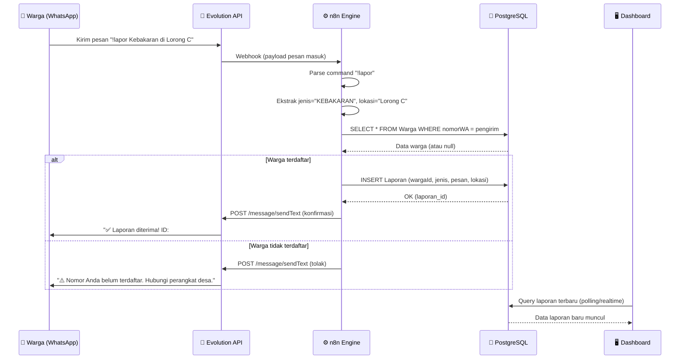
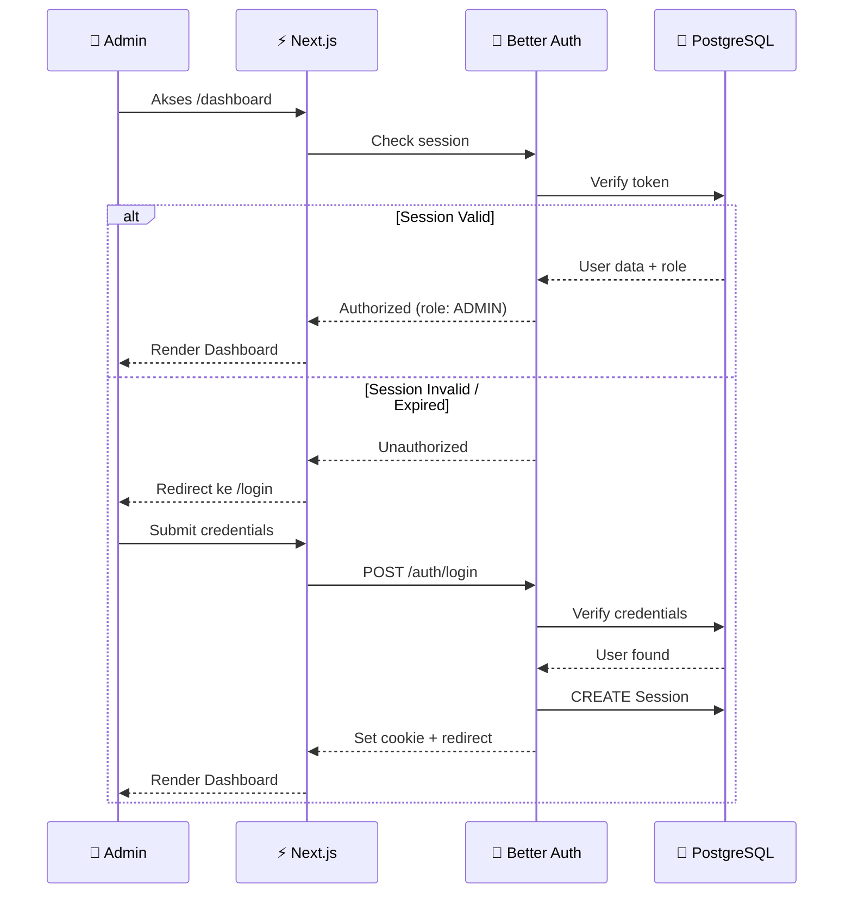
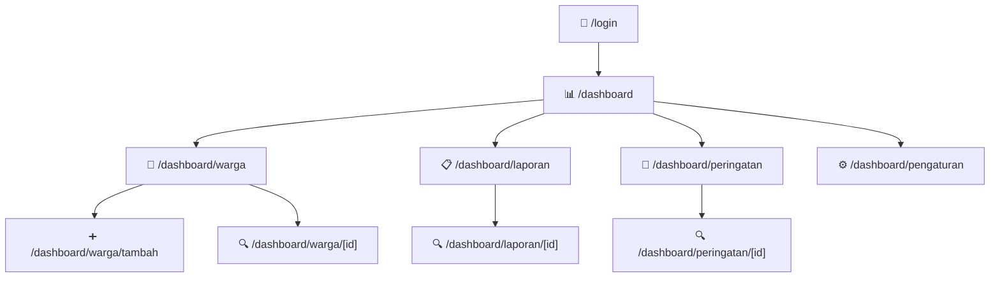
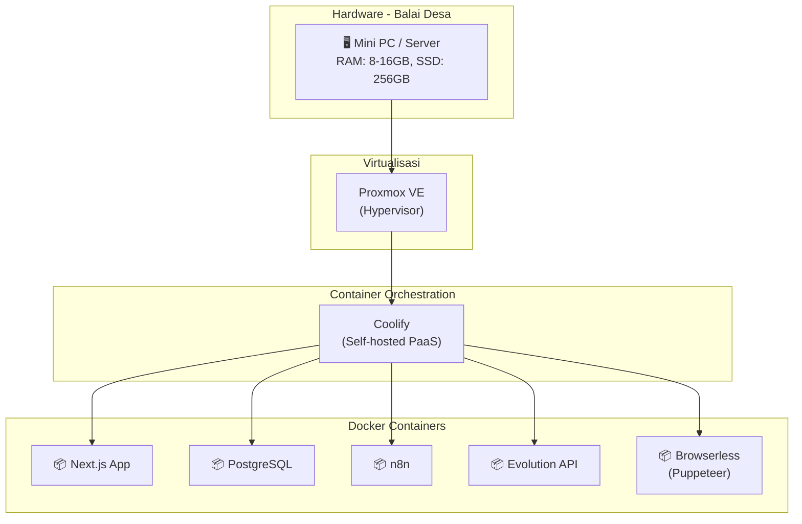

# 📐 Analisa Perancangan Sistem — Gampong Alert Hub

> **Versi:** 1.0  
> **Tanggal:** 1 Juni 2026  
> **Status:** Draft  

---

## 1. Pendahuluan

### 1.1 Latar Belakang
Gampong (Desa) di Aceh memiliki tantangan unik dalam hal distribusi informasi darurat dan pelaporan warga. Sistem komunikasi yang ada saat ini (grup WhatsApp informal) rentan terhadap *hoax*, lambat, dan tidak terstruktur. Gampong Alert Hub hadir sebagai solusi *Smart Village* yang memanfaatkan infrastruktur WhatsApp yang sudah dimiliki 99% warga, dikombinasikan dengan automasi data bencana dari BMKG.

### 1.2 Tujuan Sistem
- Menyediakan sistem peringatan dini bencana otomatis berbasis data BMKG.
- Memungkinkan komunikasi dua arah antara warga dan perangkat desa via WhatsApp.
- Memberikan *dashboard* eksekutif untuk pemantauan dan pengambilan keputusan.
- Menekan biaya operasional dengan arsitektur *self-hosted* / *edge computing*.

### 1.3 Ruang Lingkup
Sistem mencakup 4 modul utama: **Ingestion Data**, **Broadcast Darurat**, **Laporan Warga**, dan **Dashboard Admin**.

---

## 2. Analisis Kebutuhan

### 2.1 Kebutuhan Fungsional

| ID   | Kebutuhan | Prioritas | Modul |
|------|-----------|-----------|-------|
| FR1  | Polling data BMKG setiap 5 menit secara otomatis | Tinggi | Ingestion |
| FR2  | Parsing XML BMKG ke JSON dan filter wilayah Aceh | Tinggi | Ingestion |
| FR3  | Broadcast peringatan dini ke seluruh nomor warga terdaftar | Tinggi | Broadcast |
| FR4  | Menerima pesan WhatsApp masuk via webhook Evolution API | Tinggi | Laporan Warga |
| FR5  | Parsing perintah `!lapor` dari pesan masuk | Tinggi | Laporan Warga |
| FR6  | Menyimpan laporan warga ke database PostgreSQL | Tinggi | Laporan Warga |
| FR7  | Menampilkan ringkasan data (kartu metrik) di dashboard | Tinggi | Dashboard |
| FR8  | Menampilkan tabel riwayat peringatan dan laporan warga | Tinggi | Dashboard |
| FR9  | Autentikasi admin (login/logout) | Sedang | Dashboard |
| FR10 | Manajemen data kontak warga (CRUD) | Sedang | Dashboard |
| FR11 | Ubah status laporan (TERKIRIM → DIPROSES → SELESAI) | Sedang | Dashboard |
| FR12 | Generate laporan PDF otomatis untuk akuntabilitas Dana Desa | Rendah | Dashboard |

### 2.2 Kebutuhan Non-Fungsional

| ID   | Kebutuhan | Target |
|------|-----------|--------|
| NFR1 | Waktu pengiriman broadcast sejak data BMKG masuk | ≤ 10 detik |
| NFR2 | Waktu tampil laporan warga di dashboard sejak pesan masuk | ≤ 3 detik |
| NFR3 | Kapasitas broadcast simultan | ≥ 1.000 pesan |
| NFR4 | Ketersediaan sistem (uptime) | ≥ 99% |
| NFR5 | Responsivitas UI dashboard | Desktop + Tablet |
| NFR6 | Keamanan data warga | Enkripsi + RBAC |

---

## 3. Arsitektur Sistem

### 3.1 Diagram Arsitektur Tingkat Tinggi

### 3.2 Pola Arsitektur

| Aspek | Pendekatan | Justifikasi |
|-------|-----------|-------------|
| **Deployment** | Edge Computing (On-Premise) | Menekan biaya cloud, data sensitif tetap di lokal |
| **Orkestrasi** | Event-Driven (n8n Workflows) | Fleksibel, visual, mudah dimodifikasi non-developer |
| **Database** | Relational (PostgreSQL) | ACID compliance, cocok untuk data terstruktur |
| **ORM** | Prisma + ZenStack | Type-safe, auto-generate CRUD, built-in RBAC |
| **Auth** | Better Auth | Ringan, self-hosted, mendukung berbagai strategi |
| **Gateway** | REST API (Evolution API) | Open-source, stabil, fitur lengkap untuk WhatsApp |
| **Frontend** | SSR + CSR Hybrid (Next.js App Router) | SEO untuk halaman publik, interaktif untuk dashboard |

---

## 4. Perancangan Data (Entity Relationship Diagram)

### 4.1 ERD

### 4.2 Deskripsi Entitas

| Entitas | Deskripsi | Relasi |
|---------|-----------|--------|
| **User** | Pengguna dashboard (admin/operator) | Has many Session |
| **Session** | Sesi login aktif | Belongs to User |
| **Warga** | Data warga terdaftar di Gampong | Has many Laporan |
| **Laporan** | Laporan darurat/insiden dari warga | Belongs to Warga |
| **LogPeringatan** | Catatan peringatan yang diterima dari BMKG | Has many LogBroadcast |
| **LogBroadcast** | Catatan statistik pengiriman broadcast | Belongs to LogPeringatan |
| **Pengaturan** | Konfigurasi sistem (key-value store) | Standalone |

---

## 5. Perancangan Proses (Sequence Diagram)

### 5.1 Alur Peringatan Dini Bencana

### 5.2 Alur Pelaporan Warga

### 5.3 Alur Autentikasi Dashboard

---

## 6. Perancangan Antarmuka (Interface Design)

### 6.1 Peta Halaman (Sitemap)

### 6.2 Spesifikasi Halaman

| Halaman | Komponen Utama | Aksi |
|---------|---------------|------|
| `/login` | Form email + password | Login via Better Auth |
| `/dashboard` | Kartu metrik, Tabel laporan terkini, Grafik tren | Overview cepat |
| `/dashboard/warga` | Tabel warga (TanStack Table), Search, Filter | CRUD warga |
| `/dashboard/laporan` | Tabel laporan, Filter status/jenis, Badge status | Ubah status, lihat detail |
| `/dashboard/peringatan` | Timeline peringatan, Statistik broadcast | Lihat riwayat, re-broadcast |
| `/dashboard/pengaturan` | Form konfigurasi (interval BMKG, template pesan) | Update settings |

### 6.3 Prinsip UI/UX

- **Tema:** Dark mode utama dengan aksen warna peringatan (merah/oranye/kuning)
- **Gaya:** Glassmorphism — blur backdrop, transparansi, border halus
- **Tipografi:** Inter (heading), Roboto (body)
- **Animasi:** Framer Motion — transisi halaman, hover kartu, notifikasi slide-in
- **Responsif:** Mobile-first, breakpoint utama di 768px dan 1024px

---

## 7. Perancangan Keamanan

### 7.1 Matriks Kontrol Akses (RBAC)

| Resource | ADMIN | OPERATOR | VIEWER |
|----------|-------|----------|--------|
| Dashboard (baca) | ✅ | ✅ | ✅ |
| Warga (CRUD) | ✅ | ✅ | ❌ |
| Laporan (baca) | ✅ | ✅ | ✅ |
| Laporan (ubah status) | ✅ | ✅ | ❌ |
| Peringatan (baca) | ✅ | ✅ | ✅ |
| Peringatan (re-broadcast) | ✅ | ❌ | ❌ |
| Pengaturan sistem | ✅ | ❌ | ❌ |
| Manajemen user | ✅ | ❌ | ❌ |

### 7.2 Strategi Keamanan

- **Autentikasi:** Better Auth dengan session-based tokens
- **Otorisasi:** ZenStack policy rules (deklaratif di level ORM)
- **Data Sensitif:** Nomor WA warga di-hash/enkripsi saat penyimpanan
- **API Protection:** Rate limiting pada endpoint Evolution API webhook
- **Infrastructure:** Jaringan lokal (LAN Balai Desa), akses publik via reverse proxy + SSL

---

## 8. Perancangan Deployment

### 8.1 Stack Infrastruktur

### 8.2 Estimasi Sumber Daya

| Container | RAM (min) | CPU | Storage | Port |
|-----------|----------|-----|---------|------|
| Next.js | 512 MB | 0.5 core | 500 MB | 3000 |
| PostgreSQL | 1 GB | 0.5 core | 5 GB | 5432 |
| n8n | 512 MB | 0.5 core | 1 GB | 5678 |
| Evolution API | 512 MB | 0.5 core | 500 MB | 8080 |
| Browserless | 1 GB | 1 core | 500 MB | 3300 |
| **Total** | **~3.5 GB** | **~3 core** | **~7.5 GB** | — |

---

## 9. Analisis Risiko

| Risiko | Dampak | Probabilitas | Mitigasi |
|--------|--------|-------------|----------|
| Internet mati di Balai Desa | Tidak bisa broadcast/terima laporan | Sedang | Fallback ke jaringan lokal, buffer pesan offline |
| BMKG API berubah/down | Tidak ada data gempa | Rendah | Monitoring endpoint, notifikasi ke admin |
| WhatsApp nomor diblokir | Gateway tidak berfungsi | Sedang | Backup nomor, rotasi, compliance dengan ToS |
| Server hardware rusak | Seluruh sistem down | Rendah | Backup database terjadwal, dokumentasi recovery |
| Serangan siber (DDoS/intrusion) | Data bocor, sistem lumpuh | Rendah | Firewall, fail2ban, akses via VPN |

---

## 10. Kesimpulan

Gampong Alert Hub dirancang dengan arsitektur modular yang memisahkan concern antara **orkestrasi** (n8n), **gateway** (Evolution API), **penyimpanan** (PostgreSQL), dan **presentasi** (Next.js). Pendekatan *edge computing* memastikan biaya operasional rendah dan data sensitif warga tetap berada di lingkungan lokal Balai Desa. Sistem ini siap untuk dikembangkan secara bertahap dimulai dari MVP hingga fitur lanjutan.
