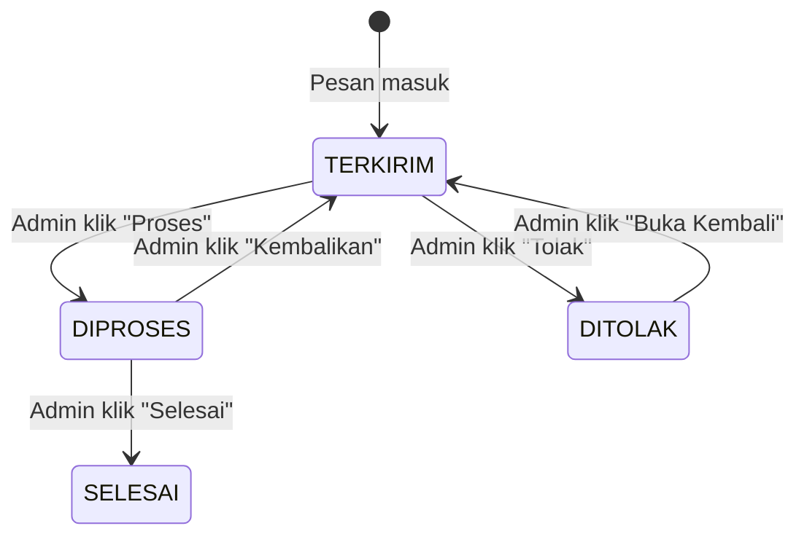
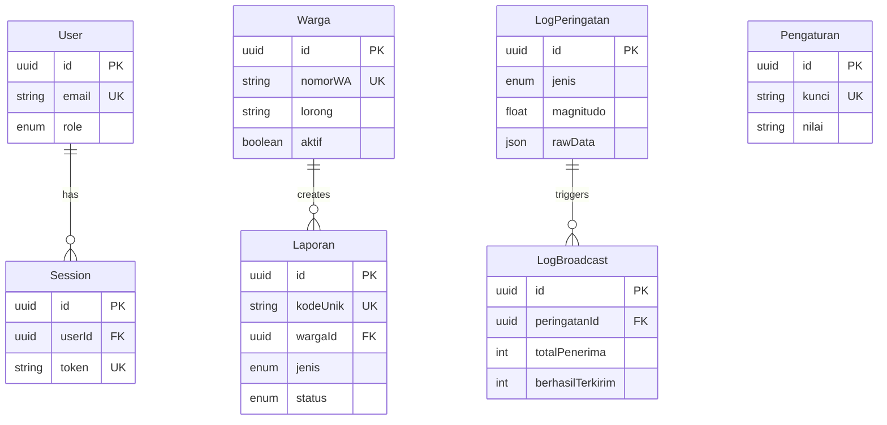

# 📚 Data Dictionary — Gampong Alert Hub

> **Versi:** 1.0  
> **Tanggal:** 1 Juni 2026  
> **Tujuan:** Dokumentasi lengkap seluruh entitas, atribut, tipe data, constraint, dan relasi dalam database sistem.

---

## 1. Ringkasan Entitas

| # | Entitas | Nama Tabel | Deskripsi | Jumlah Atribut |
|---|---------|-----------|-----------|---------------|
| 1 | [User](#11-user) | `User` | Akun pengguna dashboard (admin/operator) | 8 |
| 2 | [Session](#12-session) | `Session` | Sesi login aktif | 5 |
| 3 | [Warga](#13-warga) | `Warga` | Data warga Gampong terdaftar | 8 |
| 4 | [Laporan](#14-laporan) | `Laporan` | Laporan insiden/darurat dari warga | 10 |
| 5 | [LogPeringatan](#15-logperingatan) | `LogPeringatan` | Catatan peringatan bencana dari BMKG | 10 |
| 6 | [LogBroadcast](#16-logbroadcast) | `LogBroadcast` | Statistik pengiriman broadcast | 7 |
| 7 | [Pengaturan](#17-pengaturan) | `Pengaturan` | Konfigurasi sistem (key-value) | 5 |

---

## 2. Detail Entitas

### 2.1 User

**Deskripsi:** Menyimpan data akun pengguna yang mengakses dashboard admin.

| # | Kolom | Tipe Data | Nullable | Default | Constraint | Deskripsi |
|---|-------|----------|----------|---------|-----------|-----------|
| 1 | `id` | `String (UUID)` | ❌ | `uuid()` | PK | Identitas unik user |
| 2 | `name` | `String` | ❌ | — | — | Nama lengkap pengguna |
| 3 | `email` | `String` | ❌ | — | UNIQUE | Alamat email (untuk login) |
| 4 | `hashedPassword` | `String` | ❌ | — | — | Password yang sudah di-hash (bcrypt) |
| 5 | `role` | `Enum (Role)` | ❌ | `VIEWER` | — | Peran pengguna dalam sistem |
| 6 | `avatarUrl` | `String` | ✅ | `null` | — | URL foto profil (opsional) |
| 7 | `createdAt` | `DateTime` | ❌ | `now()` | — | Waktu pembuatan akun |
| 8 | `updatedAt` | `DateTime` | ❌ | `updatedAt()` | — | Waktu update terakhir |

**Enum `Role`:**

| Nilai | Deskripsi | Hak Akses |
|-------|-----------|----------|
| `ADMIN` | Administrator penuh | Semua fitur termasuk pengaturan & manajemen user |
| `OPERATOR` | Operator harian | CRUD warga, kelola laporan, TIDAK bisa ubah pengaturan |
| `VIEWER` | Pengamat (read-only) | Hanya bisa melihat dashboard & data, TIDAK bisa edit |

**Relasi:**
- `User` 1 ──── ∞ `Session` (satu user bisa punya banyak sesi)

**Index:**
- `email` — Unique index (untuk lookup login)

---

### 2.2 Session

**Deskripsi:** Menyimpan sesi login aktif untuk autentikasi berbasis token.

| # | Kolom | Tipe Data | Nullable | Default | Constraint | Deskripsi |
|---|-------|----------|----------|---------|-----------|-----------|
| 1 | `id` | `String (UUID)` | ❌ | `uuid()` | PK | Identitas unik sesi |
| 2 | `userId` | `String (UUID)` | ❌ | — | FK → User.id | User pemilik sesi |
| 3 | `token` | `String` | ❌ | — | UNIQUE | Token sesi (di-hash) |
| 4 | `expiresAt` | `DateTime` | ❌ | — | — | Waktu kedaluwarsa sesi |
| 5 | `createdAt` | `DateTime` | ❌ | `now()` | — | Waktu pembuatan sesi |

**Relasi:**
- `Session` ∞ ──── 1 `User`

**Index:**
- `token` — Unique index (untuk lookup autentikasi)
- `userId` — Index (untuk query sesi per user)

**Lifecycle:**
- Dibuat saat login berhasil
- Dihapus saat logout atau expired
- Expired sessions dibersihkan via cron job harian

---

### 2.3 Warga

**Deskripsi:** Menyimpan data warga Gampong yang terdaftar dalam sistem broadcast WhatsApp.

| # | Kolom | Tipe Data | Nullable | Default | Constraint | Deskripsi |
|---|-------|----------|----------|---------|-----------|-----------|
| 1 | `id` | `String (UUID)` | ❌ | `uuid()` | PK | Identitas unik warga |
| 2 | `nama` | `String` | ❌ | — | — | Nama lengkap warga |
| 3 | `nomorWA` | `String` | ❌ | — | UNIQUE | Nomor WhatsApp (format: `628xxx`) |
| 4 | `lorong` | `String` | ❌ | — | — | Nama lorong/dusun tempat tinggal |
| 5 | `alamat` | `String` | ✅ | `null` | — | Alamat lengkap (opsional) |
| 6 | `aktif` | `Boolean` | ❌ | `true` | — | Status aktif (false = soft delete) |
| 7 | `createdAt` | `DateTime` | ❌ | `now()` | — | Waktu registrasi |
| 8 | `updatedAt` | `DateTime` | ❌ | `updatedAt()` | — | Waktu update terakhir |

**Relasi:**
- `Warga` 1 ──── ∞ `Laporan` (satu warga bisa punya banyak laporan)

**Index:**
- `nomorWA` — Unique index (untuk deduplikasi & lookup dari webhook)
- `lorong` — Index (untuk filter & broadcast per lorong)
- `aktif` — Index (untuk query warga aktif saat broadcast)

**Validasi Bisnis:**
- `nomorWA` harus diawali `62` (kode negara Indonesia)
- `nomorWA` minimal 10 digit, maksimal 15 digit
- `nama` minimal 2 karakter
- Soft delete: set `aktif = false`, data tetap tersimpan

---

### 2.4 Laporan

**Deskripsi:** Menyimpan laporan insiden/darurat yang dikirim warga melalui WhatsApp.

| # | Kolom | Tipe Data | Nullable | Default | Constraint | Deskripsi |
|---|-------|----------|----------|---------|-----------|-----------|
| 1 | `id` | `String (UUID)` | ❌ | `uuid()` | PK | Identitas unik laporan |
| 2 | `kodeUnik` | `String` | ❌ | Auto-generate | UNIQUE | Kode tampil (format: `LP-XXXX`) |
| 3 | `wargaId` | `String (UUID)` | ❌ | — | FK → Warga.id | Warga yang melapor |
| 4 | `jenis` | `Enum (JenisLaporan)` | ❌ | `LAINNYA` | — | Kategori insiden |
| 5 | `pesan` | `String (Text)` | ❌ | — | — | Isi pesan lengkap dari warga |
| 6 | `lokasi` | `String` | ✅ | `null` | — | Lokasi kejadian (hasil parsing) |
| 7 | `status` | `Enum (StatusLaporan)` | ❌ | `TERKIRIM` | — | Status tindak lanjut |
| 8 | `catatanAdmin` | `String (Text)` | ✅ | `null` | — | Catatan dari admin/operator |
| 9 | `createdAt` | `DateTime` | ❌ | `now()` | — | Waktu laporan masuk |
| 10 | `updatedAt` | `DateTime` | ❌ | `updatedAt()` | — | Waktu update terakhir |

**Enum `JenisLaporan`:**

| Nilai | Deskripsi | Kata Kunci Parsing |
|-------|-----------|-------------------|
| `KEBAKARAN` | Insiden api/kebakaran | kebakaran, api, terbakar |
| `LISTRIK` | Gangguan kelistrikan | listrik, PLN, tiang, kabel |
| `KEAMANAN` | Masalah keamanan/kriminal | pencurian, maling, keamanan |
| `BENCANA` | Bencana alam | banjir, longsor, gempa, angin |
| `INFRASTRUKTUR` | Kerusakan infrastruktur | jalan, jembatan, selokan |
| `KESEHATAN` | Darurat kesehatan | sakit, ambulans, DBD |
| `LAINNYA` | Kategori lain-lain | (default jika tidak terdeteksi) |

**Enum `StatusLaporan`:**

| Nilai | Deskripsi | Warna Badge |
|-------|-----------|------------|
| `TERKIRIM` | Laporan baru masuk, belum ditindaklanjuti | 🔵 Biru |
| `DIPROSES` | Sedang dalam penanganan | 🟡 Kuning |
| `SELESAI` | Sudah selesai ditangani | 🟢 Hijau |
| `DITOLAK` | Laporan tidak valid / spam | 🔴 Merah |

**Relasi:**
- `Laporan` ∞ ──── 1 `Warga`

**Index:**
- `kodeUnik` — Unique index
- `wargaId` — Index (untuk query laporan per warga)
- `status` — Index (untuk filter)
- `jenis` — Index (untuk filter)
- `createdAt` — Index (untuk sorting & range query)
- Composite: `(status, createdAt)` — untuk query laporan terbaru per status

**Alur Status:**



---

### 2.5 LogPeringatan

**Deskripsi:** Menyimpan catatan peringatan bencana yang diterima dari BMKG dan sumber lainnya.

| # | Kolom | Tipe Data | Nullable | Default | Constraint | Deskripsi |
|---|-------|----------|----------|---------|-----------|-----------|
| 1 | `id` | `String (UUID)` | ❌ | `uuid()` | PK | Identitas unik peringatan |
| 2 | `jenis` | `Enum (JenisPeringatan)` | ❌ | — | — | Tipe bencana |
| 3 | `sumber` | `String` | ❌ | `BMKG` | — | Sumber data (BMKG, BNPB, dll) |
| 4 | `magnitudo` | `Float` | ✅ | `null` | — | Kekuatan gempa (SR) — khusus GEMPA |
| 5 | `kedalaman` | `String` | ✅ | `null` | — | Kedalaman gempa — khusus GEMPA |
| 6 | `lokasi` | `String` | ❌ | — | — | Deskripsi lokasi epicenter |
| 7 | `wilayah` | `String` | ❌ | — | — | Wilayah yang terdampak |
| 8 | `rawData` | `Json` | ❌ | — | — | Data mentah dari BMKG (JSON lengkap) |
| 9 | `waktuKejadian` | `DateTime` | ❌ | — | — | Waktu kejadian bencana |
| 10 | `createdAt` | `DateTime` | ❌ | `now()` | — | Waktu data masuk ke sistem |

**Enum `JenisPeringatan`:**

| Nilai | Deskripsi |
|-------|-----------|
| `GEMPA` | Gempa bumi |
| `TSUNAMI` | Peringatan tsunami |
| `CUACA` | Cuaca ekstrem (banjir, angin) |

**Relasi:**
- `LogPeringatan` 1 ──── ∞ `LogBroadcast`

**Index:**
- `jenis` — Index
- `wilayah` — Index
- `waktuKejadian` — Index (untuk deduplikasi & sorting)
- Composite: `(sumber, waktuKejadian)` — untuk cek duplikat

**Deduplikasi:** Sebelum insert, cek apakah sudah ada peringatan dengan `sumber` + `waktuKejadian` yang sama → skip jika duplikat.

---

### 2.6 LogBroadcast

**Deskripsi:** Menyimpan statistik dan metadata setiap pengiriman broadcast pesan.

| # | Kolom | Tipe Data | Nullable | Default | Constraint | Deskripsi |
|---|-------|----------|----------|---------|-----------|-----------|
| 1 | `id` | `String (UUID)` | ❌ | `uuid()` | PK | Identitas unik broadcast |
| 2 | `peringatanId` | `String (UUID)` | ✅ | `null` | FK → LogPeringatan.id | Peringatan terkait (null jika broadcast manual) |
| 3 | `jenisBroadcast` | `String` | ❌ | `PERINGATAN` | — | Tipe: PERINGATAN, PENGUMUMAN, MANUAL |
| 4 | `totalPenerima` | `Int` | ❌ | `0` | — | Jumlah nomor yang ditargetkan |
| 5 | `berhasilTerkirim` | `Int` | ❌ | `0` | — | Jumlah pesan yang berhasil terkirim |
| 6 | `gagalTerkirim` | `Int` | ❌ | `0` | — | Jumlah pesan yang gagal terkirim |
| 7 | `waktuMulai` | `DateTime` | ❌ | `now()` | — | Waktu broadcast dimulai |
| 8 | `waktuSelesai` | `DateTime` | ✅ | `null` | — | Waktu broadcast selesai |

**Relasi:**
- `LogBroadcast` ∞ ──── 1 `LogPeringatan` (opsional)

**Index:**
- `peringatanId` — Index
- `waktuMulai` — Index

**Kalkulasi:**
- `durasiDetik` = `waktuSelesai - waktuMulai` (dihitung di application layer)
- `persentaseSukses` = `berhasilTerkirim / totalPenerima × 100` (dihitung di application layer)

---

### 2.7 Pengaturan

**Deskripsi:** Menyimpan konfigurasi sistem dalam format key-value store.

| # | Kolom | Tipe Data | Nullable | Default | Constraint | Deskripsi |
|---|-------|----------|----------|---------|-----------|-----------|
| 1 | `id` | `String (UUID)` | ❌ | `uuid()` | PK | Identitas unik |
| 2 | `kunci` | `String` | ❌ | — | UNIQUE | Nama konfigurasi (key) |
| 3 | `nilai` | `String (Text)` | ❌ | — | — | Nilai konfigurasi (value) |
| 4 | `deskripsi` | `String` | ✅ | `null` | — | Penjelasan konfigurasi |
| 5 | `updatedAt` | `DateTime` | ❌ | `updatedAt()` | — | Waktu update terakhir |

**Seed Data Default:**

| Kunci | Nilai Default | Deskripsi |
|-------|--------------|-----------|
| `bmkg_polling_interval` | `5` | Interval polling BMKG (menit) |
| `bmkg_min_magnitude` | `3.0` | Magnitude minimum untuk broadcast |
| `bmkg_target_region` | `Aceh` | Filter wilayah BMKG |
| `template_peringatan` | `🚨 PERINGATAN DINI {{jenis}}...` | Template pesan peringatan |
| `template_konfirmasi` | `✅ Laporan Anda telah diterima...` | Template konfirmasi laporan |
| `template_penolakan` | `⚠️ Nomor Anda belum terdaftar...` | Template penolakan |
| `evolution_api_url` | `http://evolution-api:8080` | URL Evolution API |
| `evolution_api_key` | `***` | API Key (encrypted) |
| `evolution_instance` | `gampong-hub` | Nama instance WhatsApp |
| `nama_gampong` | `Gampong Alert Hub` | Nama tampilan gampong |
| `laporan_counter` | `0` | Counter untuk kode LP-XXXX |

---

## 3. Diagram Relasi (ERD Ringkas)



---

## 4. Prisma Schema (Implementasi)

```prisma
// prisma/schema.prisma

generator client {
  provider = "prisma-client-js"
}

datasource db {
  provider = "postgresql"
  url      = env("DATABASE_URL")
}

enum Role {
  ADMIN
  OPERATOR
  VIEWER
}

enum JenisLaporan {
  KEBAKARAN
  LISTRIK
  KEAMANAN
  BENCANA
  INFRASTRUKTUR
  KESEHATAN
  LAINNYA
}

enum StatusLaporan {
  TERKIRIM
  DIPROSES
  SELESAI
  DITOLAK
}

enum JenisPeringatan {
  GEMPA
  TSUNAMI
  CUACA
}

model User {
  id             String    @id @default(uuid())
  name           String
  email          String    @unique
  hashedPassword String
  role           Role      @default(VIEWER)
  avatarUrl      String?
  createdAt      DateTime  @default(now())
  updatedAt      DateTime  @updatedAt
  sessions       Session[]

  @@map("users")
}

model Session {
  id        String   @id @default(uuid())
  userId    String
  token     String   @unique
  expiresAt DateTime
  createdAt DateTime @default(now())
  user      User     @relation(fields: [userId], references: [id], onDelete: Cascade)

  @@index([userId])
  @@map("sessions")
}

model Warga {
  id        String    @id @default(uuid())
  nama      String
  nomorWA   String    @unique
  lorong    String
  alamat    String?
  aktif     Boolean   @default(true)
  createdAt DateTime  @default(now())
  updatedAt DateTime  @updatedAt
  laporan   Laporan[]

  @@index([lorong])
  @@index([aktif])
  @@map("warga")
}

model Laporan {
  id           String         @id @default(uuid())
  kodeUnik     String         @unique
  wargaId      String
  jenis        JenisLaporan   @default(LAINNYA)
  pesan        String
  lokasi       String?
  status       StatusLaporan  @default(TERKIRIM)
  catatanAdmin String?
  createdAt    DateTime       @default(now())
  updatedAt    DateTime       @updatedAt
  warga        Warga          @relation(fields: [wargaId], references: [id])

  @@index([wargaId])
  @@index([status])
  @@index([jenis])
  @@index([createdAt])
  @@index([status, createdAt])
  @@map("laporan")
}

model LogPeringatan {
  id            String           @id @default(uuid())
  jenis         JenisPeringatan
  sumber        String           @default("BMKG")
  magnitudo     Float?
  kedalaman     String?
  lokasi        String
  wilayah       String
  rawData       Json
  waktuKejadian DateTime
  createdAt     DateTime         @default(now())
  broadcasts    LogBroadcast[]

  @@index([jenis])
  @@index([wilayah])
  @@index([waktuKejadian])
  @@index([sumber, waktuKejadian])
  @@map("log_peringatan")
}

model LogBroadcast {
  id               String          @id @default(uuid())
  peringatanId     String?
  jenisBroadcast   String          @default("PERINGATAN")
  totalPenerima    Int             @default(0)
  berhasilTerkirim Int             @default(0)
  gagalTerkirim    Int             @default(0)
  waktuMulai       DateTime        @default(now())
  waktuSelesai     DateTime?
  peringatan       LogPeringatan?  @relation(fields: [peringatanId], references: [id])

  @@index([peringatanId])
  @@index([waktuMulai])
  @@map("log_broadcast")
}

model Pengaturan {
  id        String   @id @default(uuid())
  kunci     String   @unique
  nilai     String
  deskripsi String?
  updatedAt DateTime @updatedAt

  @@map("pengaturan")
}
```
