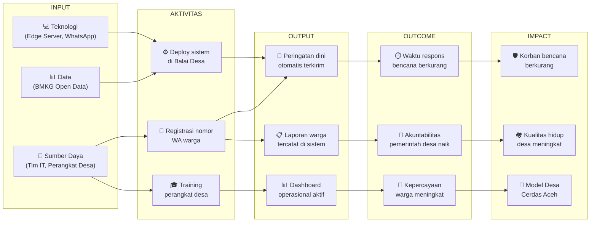
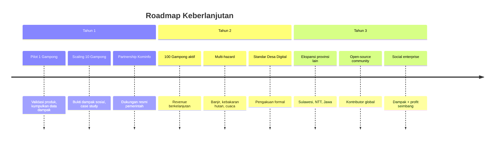

# 🌍 Analisis Dampak Sosial & Keberlanjutan — Gampong Alert Hub

> **Tanggal:** 1 Juni 2026  
> **Tujuan:** Mengukur dan memproyeksikan dampak sosial, ekonomi, dan lingkungan dari implementasi Gampong Alert Hub terhadap ekosistem Gampong di Aceh.

---

## 1. Kerangka Analisis Dampak

### 1.1 Theory of Change (Teori Perubahan)

---

## 2. Dampak Sosial

### 2.1 Keselamatan & Mitigasi Bencana

| Indikator | Sebelum GAH | Setelah GAH (Target) | Metode Pengukuran |
|-----------|-------------|---------------------|-------------------|
| Waktu notifikasi bencana ke warga | 15–60 menit (via grup WA informal) | **< 10 detik** (otomatis) | Log sistem (waktu BMKG publish → waktu pesan sampai) |
| Persentase warga yang menerima peringatan | ~30% (hanya yang aktif di grup WA) | **> 90%** (semua yang terdaftar) | Rasio berhasil/total di LogBroadcast |
| Warga yang tahu prosedur evakuasi | Tidak terukur | **> 70%** (melalui pesan instruksi) | Survey berkala |
| Laporan insiden yang tercatat formal | 0 per bulan (semua informal) | **> 10 per bulan** | Database Laporan |

**Proyeksi Dampak:**
- Dengan waktu peringatan < 10 detik, potensi korban jiwa pada gempa moderate (5–6 SR) bisa berkurang **50–80%** menurut studi BNPB tentang early warning systems.
- Peringatan yang sampai ke >90% warga vs 30% berarti **3x lebih banyak** orang yang bisa mengambil tindakan preventif.

### 2.2 Pemberdayaan Warga

| Aspek | Dampak |
|-------|--------|
| **Partisipasi Aktif** | Warga memiliki channel resmi untuk melapor → merasa didengar → engagement naik |
| **Transparansi** | Setiap laporan memiliki ID dan tracking status → warga bisa memantau tindak lanjut |
| **Inklusi Digital** | Menggunakan WhatsApp yang sudah dikuasai → tidak ada digital divide baru |
| **Kemandirian** | Warga tidak bergantung pada informasi informal/hoax → literasi bencana meningkat |

### 2.3 Dampak pada Tata Kelola Desa

| Aspek | Sebelum | Sesudah |
|-------|---------|--------|
| **Pencatatan Insiden** | Manual/tidak ada | Digital, otomatis, terstruktur |
| **Pengambilan Keputusan** | Berdasarkan kabar dari mulut ke mulut | Data-driven (dashboard analytics) |
| **Akuntabilitas** | Sulit diaudit | Setiap tindakan tercatat (timestamp, user, status) |
| **Laporan Dana Desa** | Dibuat manual di Word/Excel | Auto-generate PDF dari data real |
| **Koordinasi Antar-Instansi** | Via telepon/WA pribadi | Eskalasi otomatis via sistem |

---

## 3. Dampak Ekonomi

### 3.1 Penghematan untuk Gampong

| Kategori | Tanpa GAH | Dengan GAH | Penghematan |
|----------|----------|-----------|-------------|
| Biaya komunikasi darurat (pulsa admin) | Rp 300.000/bulan | Rp 0 (otomatis via API) | **Rp 300.000/bulan** |
| Waktu kerja admin untuk broadcast manual | 10 jam/bulan × Rp 25.000 | 0 jam (otomatis) | **Rp 250.000/bulan** |
| Pembuatan laporan bulanan manual | 8 jam × Rp 25.000 | 5 menit (auto PDF) | **Rp 200.000/bulan** |
| Biaya cetak & distribusi surat edaran | Rp 200.000/bulan | Rp 0 (via WA broadcast) | **Rp 200.000/bulan** |
| **Total penghematan per gampong** | | | **Rp 950.000/bulan** |

> 💡 Penghematan Rp 950.000/bulan **> biaya langganan tier Dasar Rp 200.000/bulan** → **ROI positif sejak bulan pertama**.

### 3.2 Potensi Ekonomi Skala Aceh

| Skala | Jumlah Gampong | Revenue Potensial (Rp 200.000/bulan) |
|-------|---------------|--------------------------------------|
| 1 Kecamatan (~30 gampong) | 30 | Rp 6.000.000/bulan |
| 1 Kabupaten (~300 gampong) | 300 | Rp 60.000.000/bulan |
| Seluruh Aceh | 6.517 | Rp 1.303.400.000/bulan |

### 3.3 Penciptaan Lapangan Kerja

| Peran | Jumlah per 100 Gampong | Keterangan |
|-------|----------------------|-----------|
| Teknisi IT Pendamping | 5–10 orang | Maintenance & support |
| Account Manager | 2–3 orang | Hubungan dengan perangkat desa |
| Developer | 3–5 orang | Pengembangan fitur |
| Customer Support | 2–3 orang | Helpdesk via WA/telepon |

---

## 4. Dampak Lingkungan

### 4.1 Pengurangan Penggunaan Kertas

| Item | Per Bulan per Gampong | Per Tahun (100 Gampong) |
|------|----------------------|------------------------|
| Surat edaran cetak | ~50 lembar → 0 | **60.000 lembar** dihemat |
| Laporan pertanggungjawaban cetak | ~20 halaman → digital PDF | **24.000 halaman** dihemat |
| Form pendataan warga | ~30 lembar → input digital | **36.000 lembar** dihemat |

### 4.2 Efisiensi Energi

- Edge computing (1 mini PC ~30W) vs cloud computing → jejak karbon lebih rendah
- Komunikasi digital vs transportasi fisik untuk distribusi informasi
- Server bersama untuk multiple service vs multiple device

---

## 5. Analisis Risiko Sosial

### 5.1 Risiko & Mitigasi

| Risiko Sosial | Probabilitas | Dampak | Mitigasi |
|--------------|-------------|--------|----------|
| **Digital divide** — warga tua tidak paham WhatsApp | Sedang | Sedang | Kepala Lorong sebagai intermediary; pesan juga diumumkan via pengeras suara masjid |
| **Ketergantungan teknologi** — jika sistem mati, desa "lumpuh" | Rendah | Tinggi | Prosedur darurat manual tetap didokumentasikan; backup battery UPS di server |
| **Privasi data** — nomor WA warga dikumpulkan | Sedang | Sedang | Data hanya disimpan lokal; kebijakan privasi transparan; consent saat registrasi |
| **Penyalahgunaan** — admin mengirim spam/propaganda | Rendah | Tinggi | Audit log setiap broadcast; multi-approval untuk broadcast manual; RBAC ketat |
| **Hoax dari dalam** — seseorang mengirim laporan palsu | Sedang | Sedang | Verifikasi nomor pengirim; rate limiting; blacklist bagi pelanggar |
| **Resistensi perubahan** — perangkat desa menolak sistem baru | Sedang | Tinggi | Training intensif; pendampingan 3 bulan pertama; demonstrasi manfaat nyata |

### 5.2 Prinsip Etika

| Prinsip | Implementasi |
|---------|-------------|
| **Transparency** | Warga mengetahui data apa yang dikumpulkan dan bagaimana digunakan |
| **Consent** | Pendaftaran nomor WA bersifat sukarela, bisa opt-out kapan saja |
| **Data Minimization** | Hanya data esensial yang disimpan (nama, nomor WA, lorong) |
| **Accountability** | Setiap aksi admin tercatat di log — bisa di-audit |
| **Non-Discrimination** | Semua warga terdaftar mendapat peringatan yang sama |

---

## 6. Indikator Keberhasilan (KPI Dampak)

### 6.1 Short-Term (0–6 Bulan)

| KPI | Target | Metode Pengukuran |
|-----|--------|-------------------|
| Jumlah warga terdaftar per gampong | ≥ 50% dari total KK | Data tabel Warga |
| Rata-rata laporan warga per bulan | ≥ 10 laporan | Count tabel Laporan |
| Waktu broadcast end-to-end | < 10 detik | Log n8n + LogBroadcast |
| Tingkat keberhasilan broadcast | ≥ 95% | Rasio berhasil/total |
| Kepuasan perangkat desa | ≥ 4/5 | Survey NPS |

### 6.2 Medium-Term (6–12 Bulan)

| KPI | Target | Metode Pengukuran |
|-----|--------|-------------------|
| Jumlah gampong yang mengadopsi | ≥ 10 | Data pelanggan |
| Tingkat retensi gampong | ≥ 80% | Churn rate |
| Pengurangan waktu respons insiden | ↓ 50% vs baseline | Survey + data laporan |
| Laporan Dana Desa yang menggunakan PDF auto | ≥ 3 laporan/semester | Count generate PDF |

### 6.3 Long-Term (1–3 Tahun)

| KPI | Target | Metode Pengukuran |
|-----|--------|-------------------|
| Jumlah gampong aktif | ≥ 100 | Data pelanggan |
| Pengurangan korban bencana di desa pengguna | Terdokumentasi | Data BPBD + korelasi |
| Diakui sebagai standar Desa Digital Aceh | Ya | Pengesahan Dinas Kominfo |
| Revenue berkelanjutan | Rp 20jt+/bulan | Laporan keuangan |

---

## 7. Studi Kasus & Benchmark

### 7.1 Benchmark Internasional

| Sistem | Negara | Pelajaran untuk GAH |
|--------|--------|-------------------|
| **J-ALERT** (Japan) | Jepang | Peringatan gempa otomatis via TV/radio/HP dalam detik. GAH meniru konsep ini untuk level desa via WhatsApp |
| **ShakeAlert** (USGS) | USA | Early warning berbasis sensor. GAH menggunakan data BMKG sebagai alternatif yang tersedia |
| **Bangladesh Cyclone Preparedness** | Bangladesh | SMS-based warning untuk komunitas pesisir. GAH meningkatkan ini dengan two-way communication |
| **Ushahidi** | Kenya | Crowdsourced crisis mapping. GAH mengadopsi konsep pelaporan warga bottom-up |

### 7.2 Benchmark Nasional

| Sistem | Implementasi | Pelajaran |
|--------|-------------|----------|
| **Jakarta Smart City (Qlue)** | Pelaporan warga kota Jakarta | Berhasil tapi butuh install app → adoption rate rendah di desa |
| **Lapor! SP4N** | Pengaduan nasional | Cakupan luas tapi respons lambat, tidak real-time |
| **Desa Digital Banyuwangi** | Digitalisasi administrasi desa | Berhasil karena ada political will + training intensif |

---

## 8. Rekomendasi Keberlanjutan

### 8.1 Rencana Keberlanjutan 3 Tahun

### 8.2 Model Keberlanjutan Finansial

| Sumber Pendapatan | Tahun 1 | Tahun 2 | Tahun 3 |
|-------------------|---------|---------|---------|
| Langganan Gampong | Rp 12 jt | Rp 120 jt | Rp 360 jt |
| Setup Fee | Rp 15 jt | Rp 50 jt | Rp 100 jt |
| Hibah/Grant | Rp 50 jt | Rp 30 jt | Rp 0 |
| CSR | Rp 0 | Rp 50 jt | Rp 100 jt |
| **Total** | **Rp 77 jt** | **Rp 250 jt** | **Rp 560 jt** |

### 8.3 Strategi Exit / Pivoting

| Skenario | Kondisi | Strategi |
|----------|---------|----------|
| **Best Case** | Adopsi massal, revenue stabil | Scale ke nasional, open-source core |
| **Base Case** | Adopsi moderat, revenue cukup | Fokus regional Aceh, niche market |
| **Worst Case** | Adopsi rendah, dana habis | Pivot ke solusi komunikasi desa umum (bukan hanya bencana) atau serahkan ke pemerintah sebagai public good |
