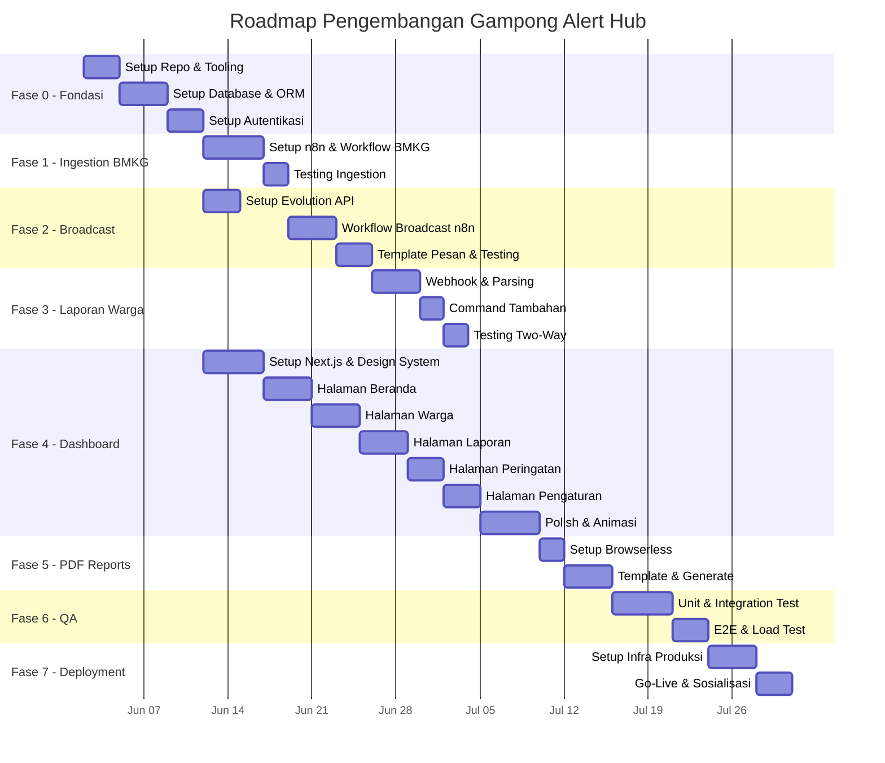

# 🗺️ Roadmap — Gampong Alert Hub

> **Versi:** 1.0  
> **Tanggal:** 1 Juni 2026  
> **Estimasi Total:** 12–16 Minggu (3–4 Bulan) untuk MVP + Polish

---

## Ikhtisar Visual

---

## Fase 0 — Fondasi & Infrastruktur *(Minggu 1–2)*

> **Tujuan:** Menyiapkan seluruh pondasi teknis agar pengembangan fitur bisa berjalan lancar.

| Milestone | Deliverable | Durasi |
|-----------|------------|--------|
| **M0.1** — Repo & Tooling | Monorepo terstruktur, linting, docker-compose dev | 3 hari |
| **M0.2** — Database | Schema Prisma final, migrasi, seed data | 4 hari |
| **M0.3** — Auth | Login/logout berfungsi, route protection aktif | 3 hari |

**✅ Definition of Done:**
- Developer bisa `docker-compose up` dan seluruh service berjalan
- Admin bisa login ke dashboard (halaman kosong OK)
- Database terisi seed data dummy

---

## Fase 1 — Ingestion Data BMKG *(Minggu 2–3)*

> **Tujuan:** Sistem secara otomatis menarik dan memproses data gempa dari BMKG.

| Milestone | Deliverable | Durasi |
|-----------|------------|--------|
| **M1.1** — Workflow n8n | Cron → HTTP Request → Parse → Filter → DB Insert | 5 hari |
| **M1.2** — Testing | Data BMKG real tersimpan di LogPeringatan | 2 hari |

**✅ Definition of Done:**
- Setiap 5 menit, n8n melakukan polling ke BMKG
- Jika ada gempa di wilayah Aceh, data tersimpan di `LogPeringatan`
- Duplikasi data tidak terjadi

---

## Fase 2 — Broadcast Darurat *(Minggu 3–4)*

> **Tujuan:** Peringatan BMKG otomatis terkirim ke seluruh nomor WhatsApp warga terdaftar.

| Milestone | Deliverable | Durasi |
|-----------|------------|--------|
| **M2.1** — Setup Gateway | Evolution API aktif, koneksi WhatsApp stabil | 3 hari |
| **M2.2** — Workflow Broadcast | Gempa → query warga → loop kirim pesan → log statistik | 4 hari |
| **M2.3** — Template & QA | Pesan rapi, test 50+ nomor, ukur latensi | 3 hari |

**✅ Definition of Done:**
- Gempa terdeteksi → pesan WhatsApp sampai ke HP warga dalam ≤ 10 detik
- Statistik broadcast (berhasil/gagal) tercatat di `LogBroadcast`
- Template pesan informatif dan estetik

---

## Fase 3 — Laporan Warga *(Minggu 4–6)*

> **Tujuan:** Warga bisa melaporkan insiden via WhatsApp dan langsung tercatat di sistem.

| Milestone | Deliverable | Durasi |
|-----------|------------|--------|
| **M3.1** — Webhook & Parsing | Pesan masuk → parse `!lapor` → simpan ke DB | 4 hari |
| **M3.2** — Command Tambahan | `!status`, `!info`, `!bantuan` | 2 hari |
| **M3.3** — Testing | Verifikasi semua skenario (terdaftar/tidak, format benar/salah) | 2 hari |

**✅ Definition of Done:**
- Warga kirim `!lapor Kebakaran di Lorong C` → laporan tersimpan, konfirmasi terkirim
- Nomor tidak terdaftar → pesan penolakan sopan terkirim
- Data laporan tampil di database dalam < 3 detik

---

## Fase 4 — Dashboard Admin *(Minggu 5–9)*

> **Tujuan:** Perangkat desa memiliki dashboard eksekutif yang fungsional dan estetik.

| Milestone | Deliverable | Durasi |
|-----------|------------|--------|
| **M4.1** — Foundation | Layout, navigasi, design system, dark mode | 5 hari |
| **M4.2** — Beranda | Kartu metrik, tabel ringkasan, grafik tren | 4 hari |
| **M4.3** — Halaman Warga | CRUD tabel warga, search, filter, import CSV | 4 hari |
| **M4.4** — Halaman Laporan | Tabel + filter status, detail modal, aksi ubah status | 4 hari |
| **M4.5** — Halaman Peringatan | Riwayat BMKG, statistik broadcast | 3 hari |
| **M4.6** — Pengaturan | Form konfigurasi sistem, manajemen user | 3 hari |
| **M4.7** — Polish | Glassmorphism, animasi, skeleton, toast, responsive | 5 hari |

**✅ Definition of Done:**
- Seluruh halaman fungsional dan terkoneksi ke data real
- UI/UX premium: glassmorphism, animasi halus, dark mode
- Responsif di tablet (min 768px) dan desktop

---

## Fase 5 — Generate Laporan PDF *(Minggu 9–10)*

> **Tujuan:** Admin bisa men-download laporan pertanggungjawaban dalam format PDF.

| Milestone | Deliverable | Durasi |
|-----------|------------|--------|
| **M5.1** — Setup | Browserless container aktif, API route siap | 2 hari |
| **M5.2** — Template & Generate | 3 jenis laporan PDF (bulanan, peringatan, warga) | 4 hari |

**✅ Definition of Done:**
- Admin klik "Download PDF" → file PDF rapi terunduh
- PDF berisi header desa, data terformat, footer halaman

---

## Fase 6 — Testing & QA *(Minggu 10–12)*

> **Tujuan:** Memastikan stabilitas dan performa sistem sebelum deployment produksi.

| Milestone | Deliverable | Durasi |
|-----------|------------|--------|
| **M6.1** — Automated Tests | Unit test, integration test, API test | 5 hari |
| **M6.2** — E2E & Performance | End-to-end scenarios, load test 1.000 pesan | 3 hari |

**✅ Definition of Done:**
- Coverage unit test ≥ 70%
- E2E test login → dashboard → laporan berjalan sukses
- Broadcast 1.000 pesan tanpa crash

---

## Fase 7 — Deployment & Go-Live *(Minggu 12–14)*

> **Tujuan:** Sistem terpasang di Balai Desa dan siap digunakan warga.

| Milestone | Deliverable | Durasi |
|-----------|------------|--------|
| **M7.1** — Infrastruktur | Proxmox + Coolify + seluruh container | 4 hari |
| **M7.2** — Go-Live | Data real, sosialisasi warga, training admin | 3 hari |

**✅ Definition of Done:**
- Seluruh container berjalan stabil di server Balai Desa
- Data warga asli terimport, WhatsApp produksi aktif
- Perangkat desa terlatih menggunakan dashboard
- Warga mengetahui nomor WhatsApp resmi Gampong

---

## 🔮 Post-Launch — Fitur Lanjutan *(Bulan 4+)*

| Prioritas | Fitur | Target |
|-----------|-------|--------|
| 🔴 Tinggi | Notifikasi real-time di dashboard (WebSocket/SSE) | Bulan 4 |
| 🔴 Tinggi | Integrasi cuaca ekstrem (banjir, angin kencang) dari BMKG | Bulan 4 |
| 🟡 Sedang | Peta interaktif lokasi laporan (Leaflet/Mapbox) | Bulan 5 |
| 🟡 Sedang | Eskalasi otomatis ke BPBD/Damkar/PLN | Bulan 5 |
| 🟡 Sedang | Multi-tenant (1 sistem untuk banyak Gampong) | Bulan 6 |
| 🟢 Rendah | Chatbot AI untuk parsing pesan natural (tanpa `!lapor`) | Bulan 7 |
| 🟢 Rendah | Aplikasi mobile (React Native) untuk admin | Bulan 8 |
| 🟢 Rendah | Integrasi e-Musrenbang dan laporan Dana Desa | Bulan 9 |

---

## 📊 KPI & Metrik Keberhasilan

| Metrik | Target MVP | Target 6 Bulan |
|--------|-----------|----------------|
| Waktu broadcast (BMKG → HP warga) | ≤ 10 detik | ≤ 5 detik |
| Waktu tampil laporan di dashboard | ≤ 3 detik | ≤ 1 detik |
| Jumlah warga terdaftar | 50 | 500+ |
| Uptime sistem | 95% | 99% |
| Laporan warga per bulan | 10 | 50+ |
| Kepuasan admin (survey) | — | ≥ 4/5 |
