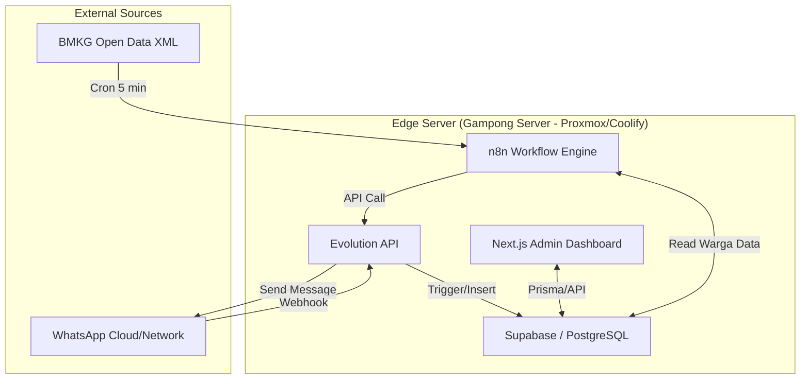

# System Architecture & Design - Gampong Alert Hub

Dokumen ini menjelaskan arsitektur perangkat lunak dan infrastruktur Gampong Alert Hub.

## 1. Topologi Infrastruktur (Deployment)

Sistem dirancang dengan arsitektur *Edge Computing*, di mana pemrosesan terjadi sedekat mungkin dengan pengguna akhir (di Balai Desa) untuk menekan biaya *cloud*.

## 2. Alur Data (Data Flow)

### 2.1 Peringatan Dini Bencana
1. **n8n** mengeksekusi HTTP Request ke server BMKG setiap 5 menit.
2. Jika ada data gempa baru, n8n mengekstrak magnitudo, waktu, dan wilayah.
3. n8n mengeksekusi *query* ke **Supabase** untuk mendapatkan seluruh nomor `Warga` terdaftar.
4. n8n mengirim *looping* *request* ke **Evolution API**.
5. Evolution API meneruskan pesan *WhatsApp* ke setiap perangkat seluler warga.

### 2.2 Pelaporan Warga
1. Warga mengetik pesan `!lapor Tiang listrik di depan masjid rubuh` dan mengirimkannya ke Nomor WA Gampong.
2. **Evolution API** menerima pesan dari jaringan WhatsApp dan memicu *Webhook* ke endpoint.
3. *Webhook* diproses (baik via n8n *Webhook trigger* maupun *Next.js API route*).
4. Data dipilah: nomor pengirim dicocokkan dengan *tabel Warga*. Pesan teks dimasukkan ke tabel *Laporan*.
5. Tabel *Laporan* di **Supabase** bertambah.
6. **Next.js Dashboard** (jika memantau secara *realtime* atau di-*refresh*) menampilkan laporan terbaru di layar admin.

## 3. Komponen Perangkat Lunak

- **Coolify:** Digunakan untuk mengelola kontainer Docker n8n, Evolution API, Supabase, dan Next.js secara rapi tanpa harus menulis panjang lebar perintah `docker-compose`.
- **Supabase / PostgreSQL:** Sebagai *Single Source of Truth* (SSOT) data Gampong.
- **Evolution API:** Karena stabil, gratis (open source), dan sangat lengkap fiturnya dibandingkan library Baileys dasar.
